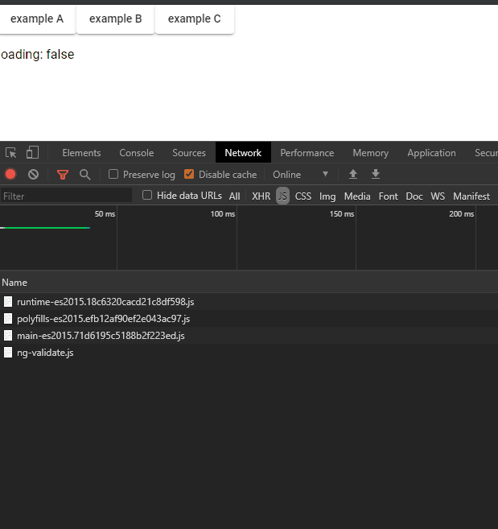

### Carregamento dinâmico de componentes

> A idéia não é substituir o `@angular/router`, mas, uma alternativa caso precise de uma solução simples.

[](https://dziul.github.io/angular-component-loader/)

#### Diretiva ComponentLoaderTarget

Vincula o componente específico

`componentLoaderTarget:string`

```html
<button type="button" componentLoaderTarget="string">Example</button>
```

#### Diretiva ComponentLoaderOutlet

Atua como espaço reservado que o Angular preenche dinamicamente com base no `componentLoaderTarget`.

```html
<ng-template componentLoaderOutlet></ng-template>
```

#### Iniciando projeto

exemplo, de arquivo de configuração dos componentes

```ts
//component-loader-config.ts
import { LoadSelector } from './shared/component-loader/component-loader.model';

const componentLoaderConfig: LoadSelector[] = [
  {
    // exemplo caso precise carregar modulo
    selector: 'app-example-a',
    component: () => import('./example-a/example-a.component').then((m) => m.ExampleAComponent),
    module: () => import('./example-a/example-a.module').then((m) => m.ExampleAModule),
  },
  {
    selector: 'app-example-b',
    component: () => import('./example-b/example-b.component').then((m) => m.ExampleBComponent),
  },
  {
    selector: 'app-example-c',
    component: () => import('./example-c/example-c.component').then((m) => m.ExampleCComponent),
  },
];

export default componentLoaderConfig;
```

Anexando ao `ComponentLoaderService`:

```ts
// app.component.ts
import { Component, OnDestroy, OnInit } from '@angular/core';
import { ComponentLoaderService } from './shared/component-loader/component-loader.service';

import { Observable } from 'rxjs';
import componentLoaderConfig from './component-loader-config';

@Component({
  selector: 'app-root',
  ...
})
export class AppComponent implements OnInit {
  loading$: Observable<boolean>;
  constructor(private componentLoader: ComponentLoaderService) {}
  ngOnInit() {
    this.componentLoader.attach(componentLoaderConfig);
    this.loading$ = this.componentLoader.loading();
  }
}
```

#### Referências

- [Loading Components Dynamically in Angular 9 with Ivy / This Dot Labs](https://labs.thisdot.co/blog/loading-components-dynamically-in-angular-9-with-ivy)
  - [loading module dynamic component](https://stackoverflow.com/questions/51404570/angular-how-to-use-shared-modules-in-a-dynamic-component)
- [Dynamic component loader / Angular](https://angular.io/guide/dynamic-component-loader)
- [Angular 8 com suporte ao Typescript 3.7](https://github.com/angular/angular-cli/issues/16071)
  - [Alternativo](https://medium.com/@andreizhamoida/typescript-3-7-1106a532e92c)

---

> This project was generated with [Angular CLI](https://github.com/angular/angular-cli) version 8.3.28.

## Development server

Run `ng serve` for a dev server. Navigate to `http://localhost:4200/`. The app will automatically reload if you change any of the source files.

## Code scaffolding

Run `ng generate component component-name` to generate a new component. You can also use `ng generate directive|pipe|service|class|guard|interface|enum|module`.

## Build

Run `ng build` to build the project. The build artifacts will be stored in the `dist/` directory. Use the `--prod` flag for a production build.

## Running unit tests

Run `ng test` to execute the unit tests via [Karma](https://karma-runner.github.io).

## Running end-to-end tests

Run `ng e2e` to execute the end-to-end tests via [Protractor](http://www.protractortest.org/).

## Further help

To get more help on the Angular CLI use `ng help` or go check out the [Angular CLI README](https://github.com/angular/angular-cli/blob/master/README.md).
